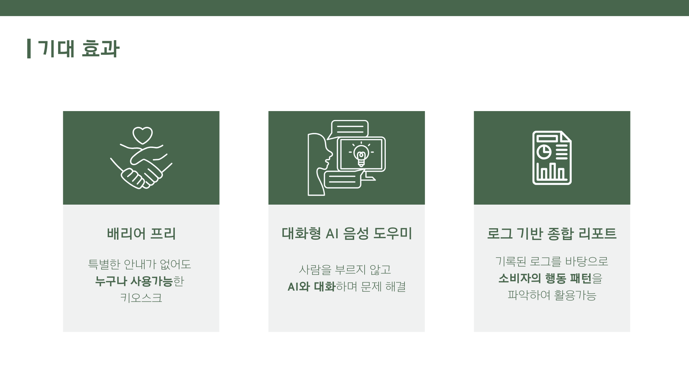
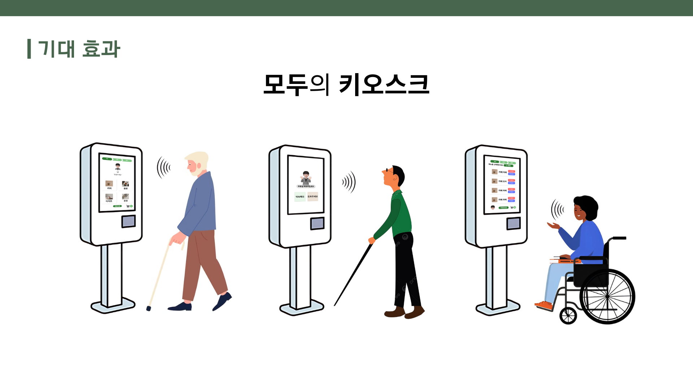
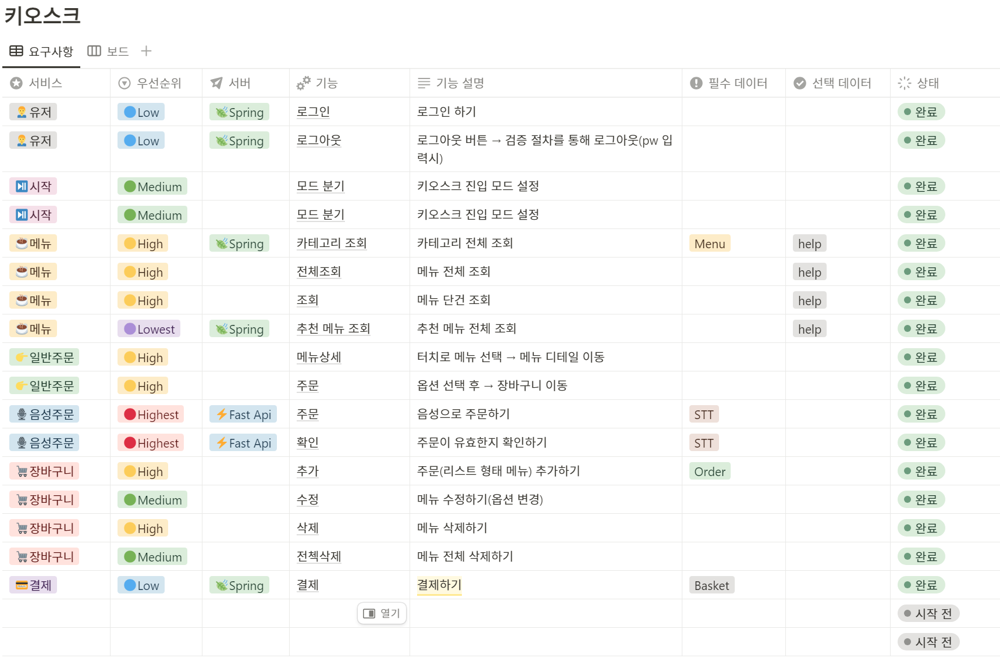
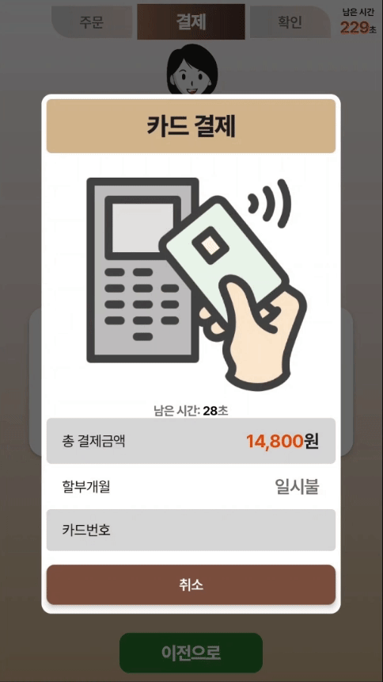
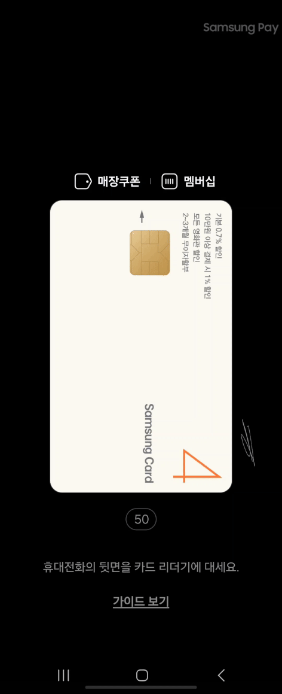
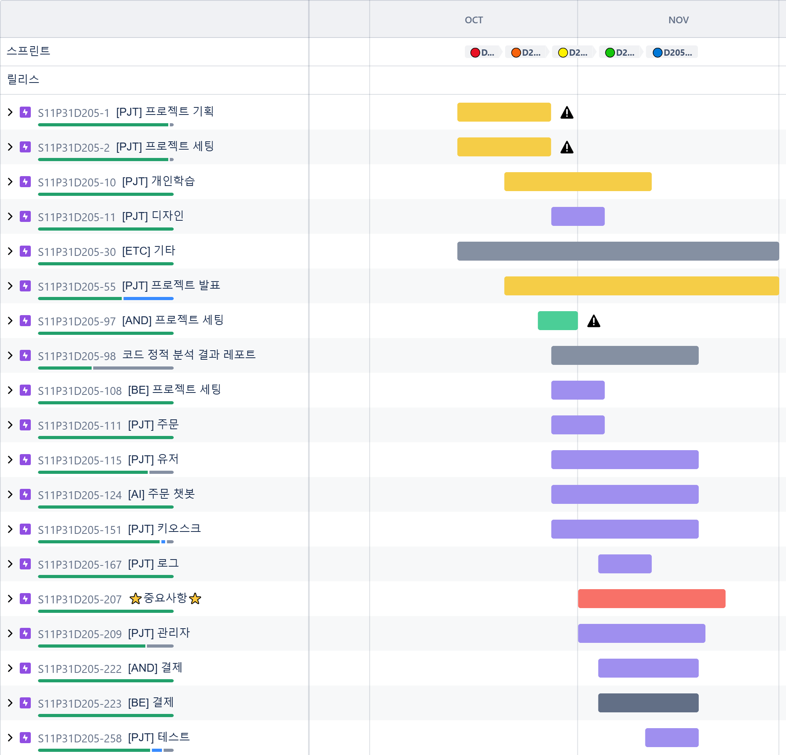
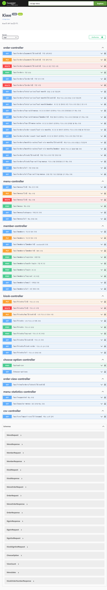
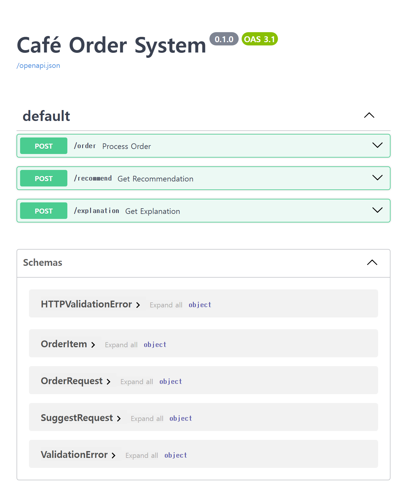

# KI-WE

### **🎉 SSAFY 11기 자율 프로젝트**

---

### [🎥 UCC](https://www.youtube.com/watch?v=q1OcLkGNPWk)

---

↑ 클릭하면 UCC를 볼 수 있습니다.

### **🚩 목차**

---

1. 기획 배경
2. 서비스 소개
3. 기능 소개
4. 시연
5. 기술 스택
6. 프로젝트 일정 및 기타 산출물

### **✨ 기획 배경**

---

**개요**

- 한 줄 설명 : 디지털 약자를 위한 대화형 키오스크
- 서비스 이름 : KI-WE(키위)

**목적**

- 디지털 약자도 사용가능한 키오스크
- 대화형 챗볼을 통해 점원에게 주문하듯이 주문 가능한 키오스크 제작

**현 상황**

- 코로나19 이후 인건비 등 이유로 증가하는 키오스크에 적응하지 못한 노인 등 [디지털 약자분들의 키오스크 사용문제가 꾸준히 제기되고 있습니다.](https://www.yna.co.kr/view/MYH20210316014700797)
- 메뉴의 종류부터 수량, 추가 옵션 등 기존의 점원에게 주문하는 방식과 달리 [더 복잡한 주문 프로세스이기 때문에 사용이 어렵습니다.](https://m.dongascience.com/news.php?idx=55286)
- 특히 디지털 약자가 많은 고령층에서는 사용방법과 용어가 어렵고 새로운 것에 대한 거부감으로 인해 [키오스크 사용에 불편을 느끼고 있습니다.](https://smart.seoul.go.kr/board/41/22823/board_view.do)
- 지자체, 정부에서 키오스크 사용 교육 지원 사업을 진행중이지만 [점차 줄어드는 형세](https://www.mediatoday.co.kr/news/articleView.html?idxno=313089)이며 모든 약자들에게 도움이 될 수 없는 [근본적인 문제점이 존재합니다.](https://www.helpage.or.kr/business/story/digital-problem/)

### **✨ 서비스 소개**

---

**페르소나**

- 사용자 - 키오스크 사용이 어려운 디지털 약자
    - 키오스크에 접근하여 키오스크의 주문 프로세스를 실행할 수 있다.
    - 주문을 추가, 수정, 삭제 할 수 있다.
    - 자신의 연령대에 맞는 메뉴 3가지를 추천받을 수 있다.
    - 원하는 메뉴에 대한 설명을 들을 수 있다.
- 관리자 - 디지털 약자인 관리자
    - csv 파일을 통해 메뉴 데이터를 연동하고 수정할 수 있다.
    - 매장의 매출, 연령대별 인기품목, 전체 인기 품목을 확인할 수 있다.

**서비스 시퀀스**

1. 매니저로 회원가입 후 로그인을 한다.
2. 대시보드, 메뉴관리, 매장 매출 상세, 키오스크 관리 탭이 존재한다.
3. 대시보드에서는 주문, 판매 매출, 인기 메뉴, 판매량 기반 추천 메뉴 등 전반적인 데이터를 한 눈에 볼 수 있다. 또한 매출 등의 데이터는 저번 달과 비교하여 하단에 정보를 제공한다.
만약 저번 달 데이터가 없을 경우 -로 표시된다
4. 메뉴 관리 탭에서는 해당 매니저 계정에 등록된 메뉴들을 볼 수 있으며 필요시 가격 등 메뉴 정보에 대해서 수정 및 삭제 및 추가할 수 있다.
5. 매장 매출 분석 탭에서 이번 달 판매 매출, 주문 건 수 및 최근 6개월간 매출 추이와 주문 건수 추이를 차트를 통해 시각적으로 확인할 수 있다
6. 키오스크 관리 탭에서 내가 등록한 키오스크를 간단하게 확인 및 수정 삭제 추가할 수 있다

---

1. 키오스크가 첫 화면으로 메뉴 광고화면을 띄우고 있다.
2. 사용자가 키오스크 앞에 서면 인식해서 주문을 받을 수 있는 화면으로 전환한다.
3. 사용자의 얼굴을 기반으로 연령대, 성별을 추론한다.
4. 터치로 주문할 수도, 음성으로 주문할 수도 있다.
5. 터치의 경우 옵션을 선택하고, 이용할 장소를 선택하여 결제하면 된다.
6. 음성은 “도와줘”라고 말한뒤, 안내 TTS 음성에 따라 메뉴를 주문하면 된다.
7. 음성으로 계속 주문을 추가할 수 있다.
8. “메뉴 추천해줘”와 같은 문장을 말하면 LLM을 거쳐 수집한 연령대, 성별을 기반으로 메뉴를 추천해준다.
9. 추천받은 메뉴를 바로 장바구니에 담을 수 있다.
10. 결제는 키오스크 하단에 NFC 태깅을 사용한다.
11. 결제가 완료되면, 결제한 사용자의 휴대폰에 웹으로 영수증이 출력된다.
12. 키오스크는 다시 광고화면으로 돌아간다.
    
    

**기대 효과**

- 대화형 주문 방식을 통한 디지털 약자(노인, 장애인 등)의 키오스크 사용성 증가
- 편리한 인기 메뉴 확인 및 메뉴 관리로 점주의 관리성 증대

### **✨ 기능 소개**

---

[기능 명세서](https://www.notion.so/11fc9fef6f4a81a9a17df207fcf0493e?pvs=21)

**사용자앱 필수 기능**

- 메뉴 및 수량 & 옵션 선택 기능
- 메뉴 추천 및 설명 기능
- 장바구니 목록 확인 기능
- 사용자 감지 및 성별 나이 감지 기능
- 음성 인식 기능

**관리자앱 필수 기능**

- 매출 및 주문 정보 제공
- 전 달 대비 증감 정보 제공
- 연령대 별 인기메뉴 정보 제공
- 판매량 기반 추천 메뉴 구성
- 6개월 전까지의 데이터 기반 차트 시각화
    
    

**결제 기기 필수기능**

- NFC 결제 기능 + 주문번호표 전자영수증 출력

### **✨ 시연**

---

**로그인 및 키오스크 등록**

**음성 주문 프로세스**

↑ 클릭하면 시연 영상을 볼 수 있습니다.

**매니저 로그인**

**매니저 대시보드**

.png)

**매니저 메뉴관리창**

.png)

**매니저 매장 매출 상세**

.png)

**매니저 키오스크 관리**

.png)

**결제단말 결제 대기창**

**결제단말 태그 시 영수증 출력화면**

### **✨ 기술 스택**

---

- Android: Android Studio, Jetpack Compose, Orbit, Hilt, CameraX, Kotlin, Mediapipe, TFLite, Vico, Ktor, Detekt, MLkit , Coil, KSP, DataStore, compose-navigation, stt, tts, NFC
- Backend
    
    
    | **Java** | 17 |
    | --- | --- |
    | **Spring Boot** | 3.3.3 |
    | **Redis** | 7.4.0 |
    | **MySql** | 8.0.22 |
    | **Nginx** | 1.27.1 |
    | **Docker** | 27.3.1 |
    | **Jenkins** | 2.478 |
    | **Elastic** | 7.17.16 |
- Ai: FastAPI, NGROK, Colab, vLLM, Huggingface
- CI/CD:  Jenkins, Docker, AWS ec2
- 이슈 관리: Jira, Notion

**아키텍쳐 설계도**

### **✨** 프로젝트 일정 및 기타 산출물

---

**스프린트**

**Git Flow**

**Figma 화면 정의서** (디자인 에셋들 + 전체 와이어 프레임 또는 페이지 화면)

음성 주문

터치 주문

결제(NFC)

**API Interface**

- Springboot
    
    
    
- FastAPI
    
    
    

**ERD**

**하드웨어**

포터블 모니터 ↔ 윈도우 노트북 ↔ s20+를 scrspy프로그램을 통해 화면 송출 및 터치 입력을 받아 처리하였습니다.

### **✨** 팀원 소개

---

