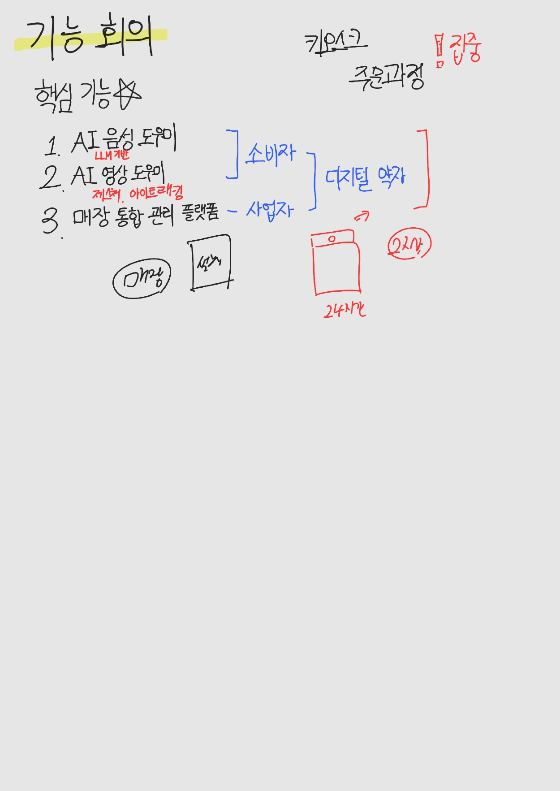
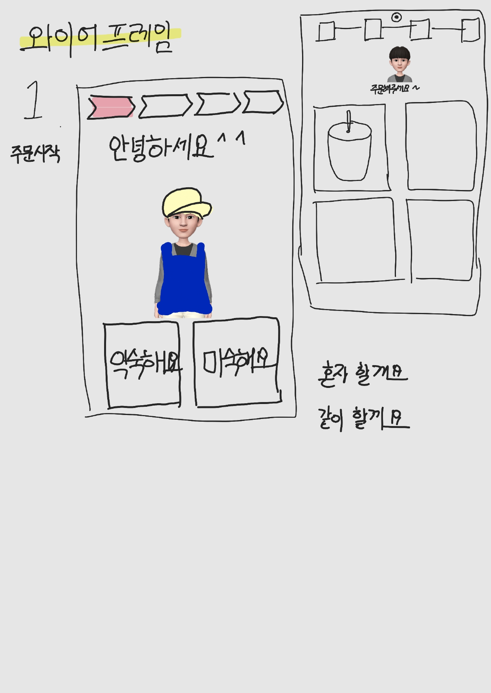
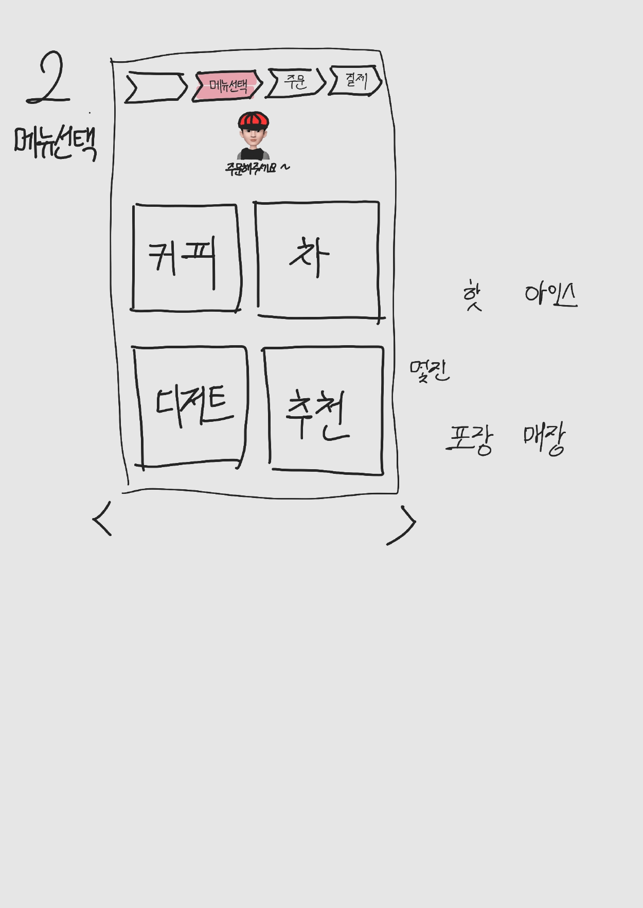
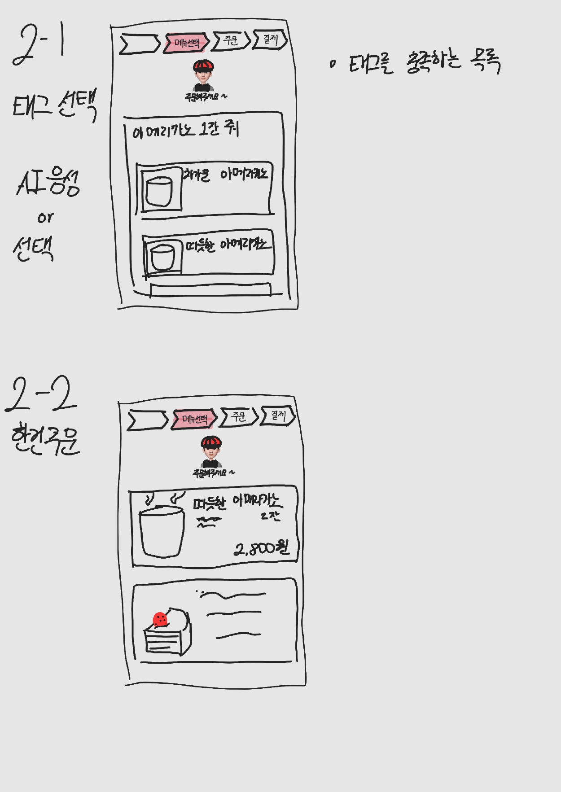
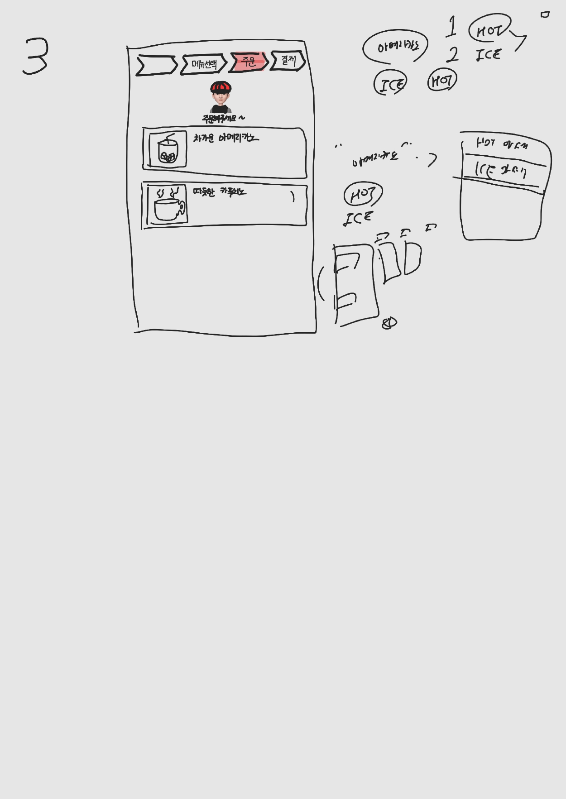
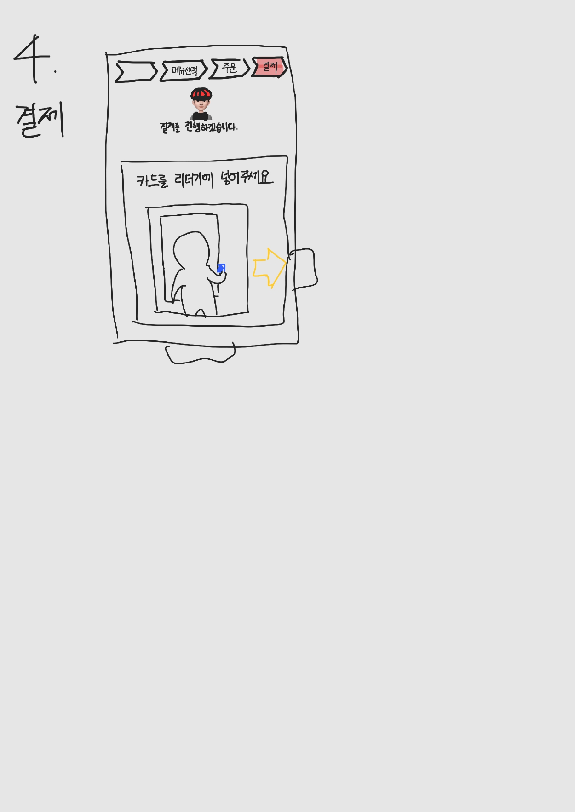
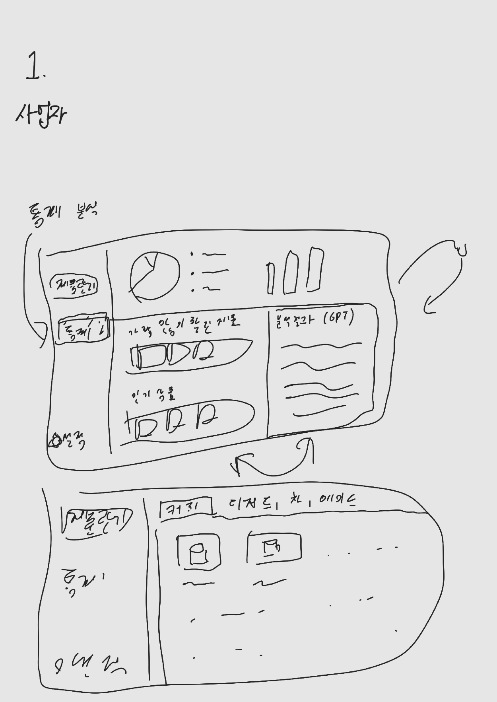
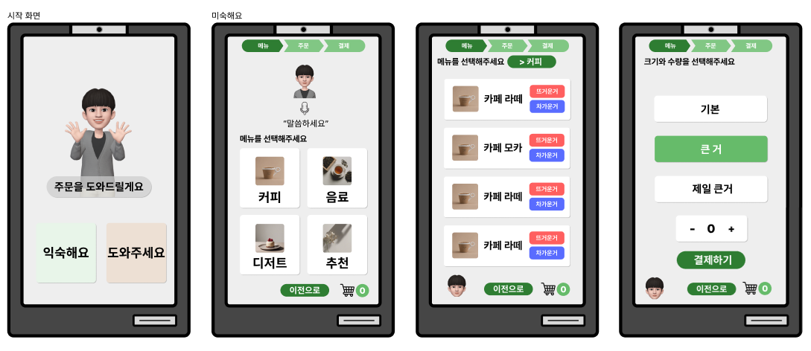
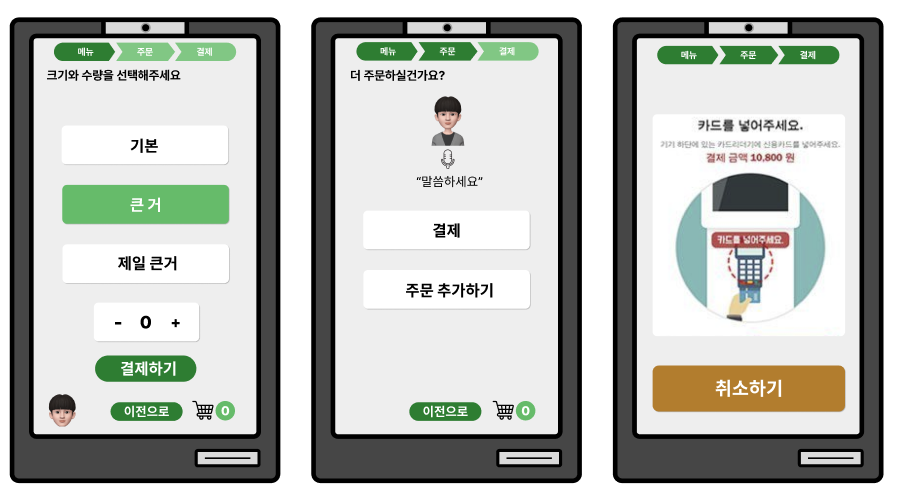

# KI - WE : 모두의 키오스크

## A. 기획

### 1. 배경

#### (1) 의도

- 요즘 키오스크를 적용하는 가게가 늘어남에 따라 디지털 약자들의 어려움을 겪고 있음.- 

- 이에 따라 우리 사회는 키오스크 교육을 실시하고, 키오스크에 추가 기능을 탑재하고 있음

- 이는 교육을 받아야하는 제한적인 요소가 들고, 오히려 기능이 많아짐에 따라 복잡해짐.

- 따라서, 사용자(디지털 약자)에게 맞춰진 키오스크를 AI와 융합하여 적용시키고자 함.

#### (2) 참고

- [키오스크가 두려운 ‘고령층’…디지털 격차 해소 대책은? / KBS 2022.05.09.](https://www.youtube.com/watch?v=u_UqKOiXRtA)

- ["어르신, 스크린 주문 천천히 하세요"…서울시 '디지털 약자와의 동행' 선언 [전국네트워크]](https://www.youtube.com/watch?v=fkxeY3qlV0M)

### 2. 기능

#### (1) AI 음성 도우미

- LLM 기반
  - ex) 커피 한잔 줘
    → `커피` 태그 + [`아이스` / `핫` 선택]

#### (2) 영상 도우미

- 제스처 (온디바이스 AI)
  - 어리둥절 감지 - 다음 동작 제안
- 아이트래킹 - 시선이 가고 있는 곳의 영역을 하이라이팅해서 가이드 제공

#### (3) 매장 통합 관리 플랫폼(사업자 과점)

- 모듈형 관리
  - 메뉴 데이터를 넣으면 그 데이터 기반으로 LLM 동작
  - 아이트래킹으로 수집한 데이터 모니터링

### 3. 와이어프레임
{: width="300"}
{: width="300"}
{: width="300"}
{: width="300"}
{: width="300"}
{: width="300"}
{: width="300"}
### 4. 목업
{: width="400"}
{: width="300"}

### 5. 기술
{: width="500"}

